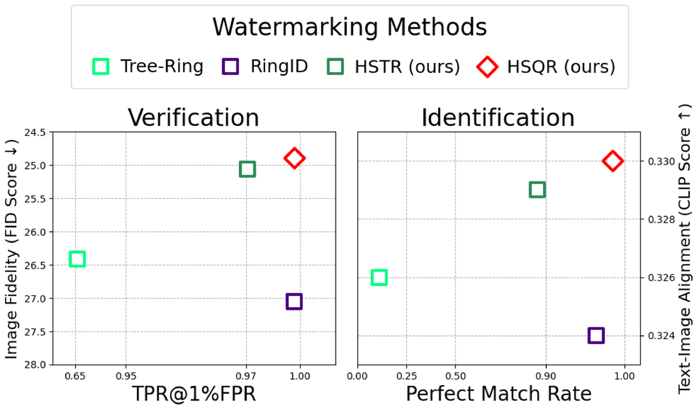

<div align="center">
<h1>🧼 SFW: Symmetric Fourier Watermarking </h1>
<!-- <h3>Semantic Watermarking Reinvented </h3> -->
<h3>Semantic Watermarking Reinvented - ICCV 2025 </h3>

[Sung Ju Lee](https://github.com/thomas11809), &nbsp; 
[Nam Ik Cho](https://scholar.google.co.kr/citations?user=Ntx5VRIAAAAJ&hl=ko&oi=ao)

<!-- Department of ECE,&nbsp; 
INMC,&nbsp;  -->
Seoul National University, South Korea

[](https://thomas11809.github.io/SFWMark/) &nbsp; 
[](https://arxiv.org/abs/2509.07647)

<p align="center">  </p>
<h6>Logo image generated by ChatGPT (OpenAI GPT-4o)</h6>

<blockquote>
  <div style="font-size: 1.2em;">
    <strong>✨ Not NSFW, but SFW: Secure, Strong, and Safe For Work 😉</strong><br>
  </div>
</blockquote>

</div>

---

This repository contains the official PyTorch implementation of the paper:  
_**"Semantic Watermarking Reinvented: Enhancing Robustness and Generation Quality with Fourier Integrity"**_  
([📄Accepted at ICCV 2025]()).

## 🧭 Overview
<p align="left"></p>

We propose a novel watermarking framework for latent diffusion models that enhances both **robustness** and **image fidelity**. 

> 🧠 **Built on Semantic Watermarking**  
> &nbsp; &nbsp; &nbsp; ✅ Merged-in-generation scheme  
> &nbsp; &nbsp; &nbsp; ✅ Fourier domain embedding  
> &nbsp; &nbsp; &nbsp; ✅ Center-aware design

## 📦 Installation
This project is based on an Anaconda virtual environment.

```bash
git clone https://github.com/thomas11809/SFWMark.git
cd SFWMark
conda create -n sfw python=3.10 -y
conda activate sfw
bash install.sh
```

If you encounter any _version compatibility issues_ during installation, please refer to `requirements-lock.txt` in the repository.  
It contains the full output of `pip freeze` with all dependencies included.

## ⚡ Quick Start
We provide a script for **fast watermark embedding and detection** to simplify the usage.  
It evaluates both:  
- The **CLIP score** of generated images, and
- The performance of watermark **verification and identification**
```bash
# Example usage
python quick_start.py \
  --prompt "A cozy cabin in snowy mountains" \
  --wm_type HSQR \
  --attacks "JPEG" "Diffusion" "CC" "RC"
```
The detection output includes the **L1 distance**, which indicates watermark presence.  
Our methods (*HSTR* and *HSQR*) show a larger distance gap between clean and watermarked images compared to the baselines — indicating a more **robust** and **secure** design for detection.

Input arguments:  
- `--prompt`: Text prompt used for image generation.
- `--wm_type`: Select the watermarking method. Supports two baselines and two proposed methods. See the [supporting methods](https://github.com/thomas11809/SFWMark?tab=readme-ov-file#-baselines) for details.
- `--attacks`: Choose from the following perturbations to apply before detection: 
`"Brightness" "Contrast" "JPEG" "Blur" "Noise" "BM3D" "VAE-B" "VAE-C" "Diffusion" "CC" "RC"`
- `--output_dir`: Directory to save output images.
- `--threshold`: Manually set a classification threshold for watermark detection.

## 🔍 Methods

<p align="left"></p>

Our method improves semantic watermarking by:
- Introducing **Hermitian Symmetric Fourier Watermarking (SFW)** to preserve frequency integrity and reduce artifacts
- Applying **center-aware embedding** to improve robustness against cropping attacks

Watermarks are embedded into the **latent noise** of diffusion models and later detected by performing **DDIM inversion**, followed by analysis in the **Fourier domain** of the reconstructed latent.

This approach outperforms existing methods across various attack scenarios (e.g., signal distortions, regenerations, and cropping), without requiring model fine-tuning or additional training.

### ✨ Key Features
- 🌀 **Hermitian SFW**: Frequency-preserving embedding for stable watermark detection and high image quality
- 🎯 **Center-Aware Embedding**: Robust against cropping via spatially focused watermarking
- 🔳 **QR-Code Watermarks (HSQR)**: Structured, high-capacity encoding in the latent Fourier domain
- 🛡️ **SOTA Robustness**: Excels under signal, compression, regeneration, and cropping attacks
- ⚙️ **Training-Free Integration**: Plug-and-play embedding during generation with no additional overhead

## 🧪 Evaluation

### 🗂️ Datasets
---
We evaluate our method on the following text-to-image prompt datasets:
- coco: 5,000 samples from MS-COCO captions
- Gustavo: 8,192 samples from SD-Prompts
- DB1k: 1,001 samples from DiffusionDB-1k

📥 You can download all three datasets used in the paper as a single archive: [`text_dataset.zip`](https://drive.google.com/file/d/17Qsc5pVGnd6YcRjgCi7ZIKyUxyIqAf-K/view?usp=sharing)

After downloading, unzip the file and **place its contents in**: `src/text_dataset/`

### 🔁 Reproducing Results
---
The main experimental results in the paper can be reproduced using the following scripts:
```bash
cd src

# Detection performance
python results/results_detect.py

# Generation quality (FID and CLIP Scores)
python results/results_gen.py
```

### 🚀 Usage
---
To run the entire pipeline **from scratch**, use the following commands in sequence.  
Results will be saved in the `outputs/` directory by default.
You can change the output location using the `--output_dir` argument.

```bash
cd src

# 1. Generate watermarked samples (5000 for COCO)
python generate.py --wm_type HSQR --dataset_id coco 

# 2. Compute FID (for COCO) and CLIP scores
python metric.py --wm_type HSQR --dataset_id coco

# 3. Run diffusion-based regeneration attack
python diff_attack/diff_wm_attack.py --wm_type HSQR --dataset_id coco

# 4. Evaluate detection statistics across 12 cases (1000 samples)
python detect.py --wm_type HSQR --dataset_id coco
```

This example demonstrates how to reproduce results using the `HSQR` watermarking method.  
You can also try other semantic watermarking techniques compatible with this pipeline using the `--wm_type` argument.  
(All of them are based on the **merged-in-generation** paradigm.)

#### 📌 Baselines
- `Tree-Ring`
- `RingID`

#### ✨ Ours
- `HSTR`
- `HSQR`

## 🖼️ Qualitative Results
<p align="left"></p>

## ✅ To Be Done
✅ Provide a **Quick Start** script for fast watermark embedding and detection.  
⬜️ Add [Usage] support for *Zodiac*, the post-hoc semantic watermarking baseline used in the paper.  
⬜️ Add [Usage] support for bitstream-based methods used as baselines in the paper (*DwtDct, DwtDctSvd, RivaGAN, Stable Signature, Gaussian Shading*).  

## 📝 Citation
If you find this work useful, please consider citing our paper:
```
@inproceedings{lee2025semantic,
  title={Semantic Watermarking Reinvented: Enhancing Robustness and Generation Quality with Fourier Integrity},
  author={Lee, Sung Ju and Cho, Nam Ik},
  booktitle={Proceedings of the IEEE/CVF International Conference on Computer Vision},
  pages={18759--18769},
  year={2025}
}
```

## 📄 License & Contact
This repository is licensed under the **CC BY-NC 4.0** license.  
You are free to use this code for research and non-commercial purposes only.  
For commercial licensing requests, please contact the authors.

📫 If you have any questions or inquiries, please contact: **thomas11809@snu.ac.kr**

## 🙏 Acknowledgement
This project is based on the following projects. We thank the authors for releasing their great work as open-source.
- [Tree-Ring Watermarks: Fingerprints for Diffusion Images that are Invisible and Robust](https://github.com/YuxinWenRick/tree-ring-watermark)
- [RingID: Rethinking Tree-Ring Watermarking for Enhanced Multi-Key Identification](https://github.com/showlab/RingID)
- [Attack-Resilient Image Watermarking Using Stable Diffusion](https://github.com/zhanglijun95/ZoDiac)
- [invisible-watermark](https://github.com/ShieldMnt/invisible-watermark)
- [The Stable Signature: Rooting Watermarks in Latent Diffusion Models](https://github.com/facebookresearch/stable_signature)
- [Gaussian Shading: Provable Performance-Lossless Image Watermarking for Diffusion Models](https://github.com/bsmhmmlf/Gaussian-Shading)
